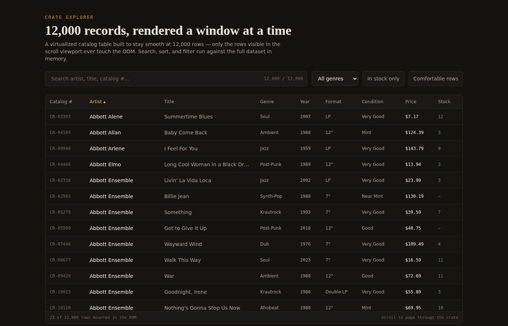

# Crate Explorer

A virtualized data table for browsing a 12,000-row catalog (a record store's
vinyl inventory, as the example dataset) without the UI slowing down as the
dataset grows. Search, sort, and filter all run against the full in-memory
dataset, and the table only ever mounts the rows currently in view.



## Features

- **Search** across artist, title, and catalog number — debounced so typing
  doesn't re-filter 12,000 rows on every keystroke
- **Sort** by artist, title, genre, year, price, or stock — click a column
  header to toggle ascending/descending
- **Filter** by genre and by stock availability
- **Row density toggle** (comfortable/compact) — a global preference stored
  in Context, independent of the filter/sort state
- **Virtualized table body** — only the rows inside the visible scroll
  viewport (plus a small overscan buffer) are ever mounted in the DOM. The
  status bar at the bottom of the table shows this live: *"23 of 12,000 rows
  mounted in the DOM"*
- Responsive down to mobile (horizontal scroll for the table, stacked
  controls, visible focus states, `prefers-reduced-motion` respected)

## Tech stack

| Layer | Choice |
|---|---|
| Framework | React 19 + TypeScript |
| Build tool | Vite |
| Virtualization | `@tanstack/react-virtual` |
| Styling | Tailwind CSS |
| Testing | Vitest + React Testing Library |
| Mock data | `@faker-js/faker` (dev-only, generates a static JSON file) |

## Getting started

```bash
npm install
npm run dev          # start the dev server
npm run build         # type-check + production build
npm run test           # run the test suite once
npm run test:watch    # run tests in watch mode
npm run generate-data # regenerate the 12,000-row mock dataset
```

The dataset is pre-generated and committed at `public/records.json` (~2.2MB),
so `npm run dev` works immediately without running the generator.

## Architecture

```
src/
├── types/record.ts        # domain types (VinylRecord, SortState, FilterState)
├── state/filterReducer.ts # reducer for the combined query/genre/stock/sort state
├── context/
│   └── PreferencesContext.tsx  # row-density preference + usePreferences() hook
├── lib/recordUtils.ts     # pure filter/sort/format functions — no React here
├── hooks/
│   ├── useDebounce.ts        # generic debounce hook (used for search)
│   ├── useDeferredSearch.ts  # useDeferredValue-based alternative (not wired in, see below)
│   └── useRecords.ts         # fetches the catalog, exposes loading/error state
├── components/
│   ├── SearchBar.tsx
│   ├── FilterBar.tsx
│   └── CrateTable.tsx      # virtualized header + body + status bar
└── App.tsx                # wires state together, owns the useMemo pipeline
```

Business logic lives outside components: `filterRecords` and `sortRecords` in
`lib/recordUtils.ts` are plain functions that take data in and return data
out, with no hooks and no React involved. That keeps them easy to unit test
and easy to reason about independently of rendering.

## State management

`query`, `genre`, `inStockOnly`, and `sort` are combined into a single
`useReducer` (`state/filterReducer.ts`) instead of four separate `useState`
calls, since they're read together on every render and a few actions (like a
"reset filters" button) would need to touch more than one at once. Naming the
actions (`SET_GENRE`, `TOGGLE_IN_STOCK`, `SET_SORT`) also makes it clear what
can actually happen to this state, rather than a pile of individual setters.

Row density is a separate, unrelated piece of state — it doesn't affect
filtering or sorting, and other parts of the app might want to read it later
— so it lives in its own Context instead of being bundled into the reducer.
`context/PreferencesContext.tsx` only exports the provider and a
`usePreferences()` hook; the Context object itself is private, so call sites
don't know or care what the underlying mechanism is. `usePreferences()`
throws if it's used outside the provider rather than silently returning a
default, since that situation is always a bug.

Neither Redux nor Zustand is used here — for one screen with this much state,
a reducer plus a bit of Context covers it without adding a dependency that
isn't earning its keep. That calculus changes for something with more
independent pieces reading and writing shared state across many components.

## Handling expensive updates: debounce vs. useTransition vs. useDeferredValue

All three show up in this codebase, for different reasons:

- **`useDebounce`** (used for the search input) waits a fixed 200ms after the
  last keystroke before committing the value. Predictable, and easy to test
  deterministically with fake timers — but the delay is a flat guess
  regardless of how fast or slow the device actually is.
- **`useTransition`** (used for genre, stock filter, and sort clicks) marks
  the resulting state update as low-priority, so React keeps the UI
  responsive while the update — which can mean re-filtering/re-sorting up to
  12,000 rows — happens in the background. It exposes `isPending`, which
  `CrateTable` uses to dim the table slightly and show "updating…" in the
  status bar. This fits discrete, already-batched actions like a click,
  rather than a continuous stream like typing.
- **`useDeferredValue`** (`hooks/useDeferredSearch.ts`) is kept as an
  alternative implementation for the search input, fully tested but not
  wired into `App.tsx`. It defers re-rendering the expensive consumer only
  as long as something more urgent needs the main thread, with no fixed
  delay — it adapts to actual load instead of a hardcoded number, at the
  cost of being harder to reason about and test deterministically than a
  fixed debounce.

Search ended up using debounce specifically because a fixed, predictable
delay was easier to test and easier to justify with a specific number.
Genre/stock/sort use `useTransition` because the problem there isn't a
stream of events to wait out — it's one click triggering an expensive
recompute, which is what `useTransition` is built for.

## Performance techniques

### List virtualization, not pagination

Rendering all 12,000 rows at once would mean 12,000+ DOM nodes sitting in
memory, most of them scrolled out of view. `@tanstack/react-virtual`
calculates which rows are actually inside the scroll viewport (plus a small
overscan buffer) and only renders those — typically 20-30 rows regardless of
whether the dataset is 100 rows or 100,000.

A virtualizer library handles variable scroll positions, resize observers,
and overscan tuning correctly, which is why this uses one instead of
hand-rolling it. The underlying idea, if built from scratch: track
`scrollTop`, divide by row height to get the first visible index, render only
the rows that fit in the container height, and position them with
`transform: translateY` (what this project uses) so the scrollbar size and
position stay correct.

### Debounced search input

Covered above — the search input stays instant and controlled, only the
downstream filtering work is delayed.

### `useMemo` for the filter → sort pipeline

```ts
const visibleRecords = useMemo(() => {
  const filtered = filterRecords(records, { query: debouncedQuery, genre, inStockOnly });
  return sortRecords(filtered, sort);
}, [records, debouncedQuery, genre, inStockOnly, sort]);
```

This only re-runs when one of its actual dependencies changes, not on every
render of `App`.

### `React.memo` on the row component

`Row` is wrapped in `memo()` so React can skip re-rendering rows whose props
haven't changed — relevant when the virtualizer's visible window shifts by
one row during scroll and most rows' data is unchanged, just repositioned.

## Testing

30 tests across six files:

- **`recordUtils.test.ts`** — the pure filter/sort/format functions
- **`filterReducer.test.ts`** — every reducer action, including the
  "flip direction on same key, reset to ascending on a new key" sort logic,
  and confirming the reducer never mutates its input
- **`PreferencesContext.test.tsx`** — default value, toggling, and the
  "throws outside a provider" guard, via `renderHook` with a real provider
- **`useDebounce.test.ts`** — debounce timing, using fake timers
- **`useDeferredSearch.test.tsx`** — the `useDeferredValue`-based alternative
- **`SearchBar.test.tsx`** — a component test with React Testing Library +
  `@testing-library/user-event` simulating real typing

Pure logic and reducers are tested as plain functions (fast, no DOM), hooks
are tested with `renderHook`, and only the thin UI layer needs full component
rendering.

## Out of scope

- No backend — `records.json` is a static generated file. Adding a real API
  would only change `useRecords`; the rest of the app doesn't care where the
  data comes from.
- No column resizing/reordering.
- No server-side pagination — the point is that client-side virtualization
  handles this scale comfortably without one.

## Design notes

Dark ink background, warm parchment text, a single mustard accent used
sparingly (active sort indicator, focus rings, the "in stock" toggle). Data
columns use a monospace face to read like a ledger; headings use a serif
display face for contrast against the dense tabular body.
